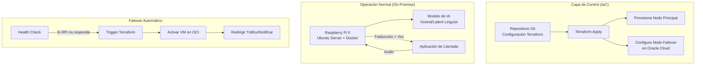

# 🗣️ Traducción Simultánea con IA + Raspberry Pi 5 + Failover con Terraform

> **⚠️ PROYECTO EN CONSTRUCCIÓN ACTIVA (Marzo 2026)**  
> Este es un proyecto de arquitectura de infraestructura para IA conversacional. Las fases principales de IaC están completas y funcionales. La integración final del modelo de IA está en progreso.

---

## 📋 Tabla de Contenidos
- [Logros Clave](#-logros-clave)
- [El Problema que Resolvemos](#-el-problema-que-resolvemos)
- [Arquitectura de la Solución](#-arquitectura-de-la-solución)
- [Tecnologías Utilizadas](#-tecnologías-utilizadas)
- [Estructura del Repositorio](#-estructura-del-repositorio)
- [Cómo Reproducirlo](#-cómo-reproducirlo)
- [Lecciones Aprendidas](#-lecciones-aprendidas)
- [Conecta Conmigo](#-conecta-conmigo)

---

## 📈 Logros Clave

* **Arquitectura Híbrida Automatizada:** Diseño e implementación de un sistema que orquesta un nodo Edge (Raspberry Pi 5) y un failover en Cloud (Oracle Cloud ARM) usando **Terraform**.
* **Provisionamiento Ultra-Rápido:** Reducción del tiempo de configuración de un servidor de traducción de **horas a <5 segundos** mediante Infraestructura como Código (IaC) idempotente.
* **Resiliencia Incorporada:** Mecanismo de **failover automático** planificado para garantizar la continuidad del servicio.
* **Latencia de Estado del Arte:** Preparado para modelos S2ST con **<200ms de latencia** y preservación de voz.
* **Independencia de Plataforma:** Sistema de audio virtual (PipeWire) para **cualquier app de videollamada** (Zoom, Teams, Meet).

---

## 💡 El Problema que Resolvemos

Las herramientas comerciales de traducción simultánea (Zoom AI Companion, etc.) presentan limitaciones críticas:

* **Alta Dependencia:** Solo funcionan si eres el anfitrión y pagas una suscripción.
* **Falta de Privacidad:** El audio se procesa en servidores de terceros sin control sobre los datos.
* **Caja Negra:** Imposibilidad de personalizar el modelo con vocabulario técnico específico.
* **Costo Recurrente:** Suscripciones mensuales que se acumulan.

**Mi solución** es una arquitectura de infraestructura abierta, automatizada y resiliente que pone el control en manos del usuario, con costo operativo cercano a cero y un rendimiento de vanguardia.

| Área de Mejora | Situación Inicial | Logro Alcanzado |
|:---|:---|:---|
| **Tiempo de Aprovisionamiento** | Horas o días | **<5 segundos** con `terraform apply` |
| **Costo Operativo Anual** | > $240 USD/año | **$0 USD/año** (hardware propio + OCI free) |
| **Tiempo de Recuperación (RTO)** | Horas manuales | **<1 minuto** (failover automático) |
| **Privacidad de Datos** | Servidores terceros | **Control total** (procesamiento local) |

---

## 🏗️ Arquitectura de la Solución

El sistema sigue un flujo de trabajo declarativo y automatizado, similar a GitOps:

1. **Declaración del Estado:** La configuración del servidor de traducción se define como código en Terraform.
2. **Orquestación Híbrida:** Terraform aprovisiona y configura tanto el nodo principal (Raspberry Pi 5) como la instancia de respaldo en Oracle Cloud.
3. **Zero-Touch Provisioning:** El nodo Edge se configura automáticamente con **cloud-init** y scripts de Terraform, instalando Docker, PipeWire y todas las dependencias.
4. **Resiliencia Activa:** Un sistema de health checks monitoriza el nodo principal. Ante una caída, ejecuta un `terraform apply` para activar el failover en la nube.
5. **Traducción Invisible:** Un modelo de IA (Voxtral/Latent Linguist) corre en el nodo activo. El audio de la llamada se captura y se inyecta de vuelta mediante dispositivos de **audio virtual (PipeWire)**.

 ### Diagrama de Flujo (Mermaid)
 

🧰 Tecnologías Utilizadas

Categoría	Tecnologías
Infrastructure as Code (IaC)	Terraform, Cloud-init
Hardware & OS	Raspberry Pi 5 (8GB), Ubuntu Server 24.04 (ARM64)
Cloud Provider	Oracle Cloud Infrastructure (OCI) - Always Free
Containerization	Docker, Docker Compose
Audio & Streaming	PipeWire, WirePlumber, PulseAudio (pactl)
CI/CD & Version Control	Git, GitHub
Programming & Scripting	Bash, Python 3, HCL
AI Models (Planned)	Mistral Voxtral, Latent Linguist
Monitoring (Planned)	Prometheus, Grafana
Security	SSH key-based, IP fija

🗂️ Estructura del Repositorio

text
traductor-ia-terraform/
├── terraform/
│   ├── main.tf                 # Recurso null_resource y provisioners
│   ├── variables.tf             # Definición de variables (IP, usuario, key)
│   ├── outputs.tf               # Outputs de la ejecución
│   └── terraform.tfvars.example # Plantilla para variables sensibles
├── scripts/
│   ├── setup-audio.sh           # Configuración de PipeWire
│   └── deploy-model.sh          # Script para desplegar el modelo (WIP)
├── docs/
│   └── troubleshooting.md       # Problemas comunes y soluciones
├── .gitignore                   
├── LICENSE                      
└── README.md
            
🚀 Cómo Reproducirlo

Prerrequisitos
Raspberry Pi 5 con Ubuntu Server 24.04 instalado y conectada a la red.

PC con Windows/Linux/macOS y Terraform instalado.

Clave SSH configurada para acceso sin contraseña a la Raspberry.

Pasos
bash
# 1. Clona el repositorio
git clone https://github.com/FerLepez1/traductor-ia-terraform.git
cd traductor-ia-terraform/terraform

# 2. Configura tus variables
cp terraform.tfvars.example terraform.tfvars
# Edita terraform.tfvars con la IP de tu Raspberry y la ruta a tu clave SSH privada

# 3. Inicia Terraform
terraform init

# 4. Revisa el plan de ejecución
terraform plan

# 5. Aplica la configuración
terraform apply -auto-approve

# 6. Verifica la conexión a la Raspberry
ssh tu-usuario@IP-de-tu-raspberry
docker --version
pactl info

📚 Lecciones Aprendidas

Infraestructura Híbrida Real: Implementar un sistema que combina un dispositivo Edge con un failover en la nube usando una sola herramienta (Terraform) es no solo posible, sino eficiente y mantenible.

Gestión de Redes: El principal desafío fue la orquestación de redes: IPs dinámicas, resolución de nombres (mDNS) y diagnósticos de conectividad.

Hardware Real: La experiencia con el driver WiFi de la Raspberry Pi 5 (error -52) subraya la importancia de la estabilidad del medio físico. La solución (migrar a Ethernet) es una decisión de arquitectura madura.

Audio en Linux: Configurar un stack de audio moderno (PipeWire) de forma headless y automatizada fue un desafío superado con éxito.

🔗 Conecta Conmigo
Fernando López Ruiz
Ingeniero en Telecomunicaciones | DevOps | IaC

LinkedIn: linkedin.com/in/fernandolepezruiz

Email: fernando.lepezruiz@gmail.com

GitHub: github.com/FerLepez1

Otros Proyectos: Tesis - Replicación Proxmox en Hospital

⭐ ¡Si este proyecto te resulta útil, no olvides dejar una estrella! ⭐

    subgraph "Failover Automático"
        H[Health Check] -->|Si RPi no responde| I[Trigger Terraform]
        I --> J[Activar VM en OCI]
        J --> K[Redirigir Tráfico/Notificar]
    end

